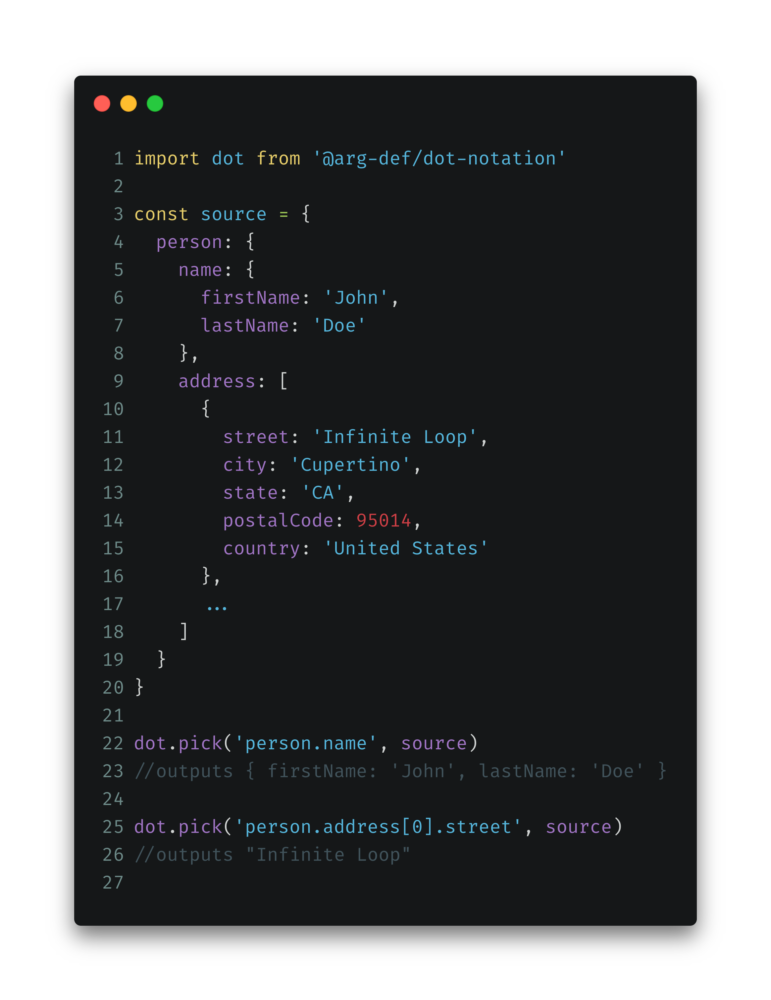

# @arg-def/dot-notation

> Object readings and transformations using dot notation syntax

[![NPM Version][npm-image]][npm-url]
[![Build Status][travis-image]][travis-url]
[![Downloads Stats][npm-downloads]][npm-url]
[![GitHub stars][stars-image]][stars-url]
[![Known Vulnerabilities][vulnerabilities-image]][vulnerabilities-url]
[![GitHub issues][issues-image]][issues-url]
[![Awesome][awesome-image]][awesome-url]




## Installation

```sh
npm install @arg-def/dot-notation --save
#or
yarn add @arg-def/dot-notation
```

## How to use

### Picking a value

```js
import dot from '@arg-def/dot-notation';

const source = {
  person: {
    name: {
      firstName: 'John',
      lastName: 'Doe'
    },
    address: [
      {
        street: 'Infinite Loop',
        city: 'Cupertino',
        state: 'CA',
        postalCode: 95014,
        country: 'United States'
      },
    ]
  }
};

dot.pick('person.name', source);
//outputs { firstName: 'John', lastName: 'Doe' }

dot.pick('person.address[0].street', source);
//outputs "Infinite Loop"
```

### Parsing an object

#### Conventional parsing

```js
import dot from '@arg-def/dot-notation';

const source = {
  'person.name.firstName': 'John',
  'person.name.lastName': 'Doe',
  'person.address[].street': 'Infinite Loop',
  'person.address[].city': 'Cupertino',
  'person.address[].postalCode': 95014,
};

dot.parse(source);

/* outputs
{
  person: {
    name: {
      firstName: 'John',
      lastName: 'Doe',
    },
    address: [
      {
        street: 'Infinite Loop',
        city: 'Cupertino',
        postalCode: 95014,
      },
    ],
  },
}
*/
```

#### With multiple array items

```js
import dot from '@arg-def/dot-notation';

const source = {
  'person.name.firstName': 'John',
  'person.name.lastName': 'Doe',
  'person.address[0].street': 'Infinite Loop',
  'person.address[0].city': 'Cupertino',
  'person.address[0].postalCode': 95014,
  'person.address[1].street': '1600 Amphitheatre',
  'person.address[1].city': 'Mountain View',
  'person.address[1].postalCode': 94043,
};


dot.parse(source);


/* outputs
{
  person: {
    name: {
      firstName: 'John',
      lastName: 'Doe',
    },
    address: [
      {
        street: 'Infinite Loop',
        city: 'Cupertino',
        postalCode: 95014,
      },
      {
        street: 'g1600 Amphitheatre',
        city: 'Mountain View',
        postalCode: 94043,
      },
    ],
  },
}
*/
```

### Parsing single key


```js
import dot from '@arg-def/dot-notation';

const source = 'person.name';
const value = 'John Doe';

dot.parseKey(source, value);

/* outputs
{
  person: {
    name: 'John Doe',
  },
}
*/
```


<!-- Markdown link & img dfn's -->
[npm-image]: https://img.shields.io/npm/v/@arg-def/dot-notation.svg?style=flat-square
[npm-url]: https://npmjs.org/package/@arg-def/dot-notation
[npm-downloads]: https://img.shields.io/npm/dm/@arg-def/dot-notation.svg?style=flat-square
[travis-image]: https://img.shields.io/travis/dbader/node-datadog-metrics/master.svg?style=flat-square
[travis-url]: https://travis-ci.org/dbader/node-datadog-metrics
[stars-image]: https://img.shields.io/github/stars/args-def/dot-notation.svg
[stars-url]: https://github.com/args-def/dot-notation/stargazers
[vulnerabilities-image]: https://snyk.io/test/github/args-def/dot-notation/badge.svg
[vulnerabilities-url]: https://snyk.io/test/github/args-def/dot-notation
[issues-image]: https://img.shields.io/github/issues/args-def/dot-notation.svg
[issues-url]: https://github.com/args-def/dot-notation/issues
[awesome-image]: https://cdn.rawgit.com/sindresorhus/awesome/d7305f38d29fed78fa85652e3a63e154dd8e8829/media/badge.svg
[awesome-url]: https://github.com/themgoncalves/react-loadable-ssr-addon